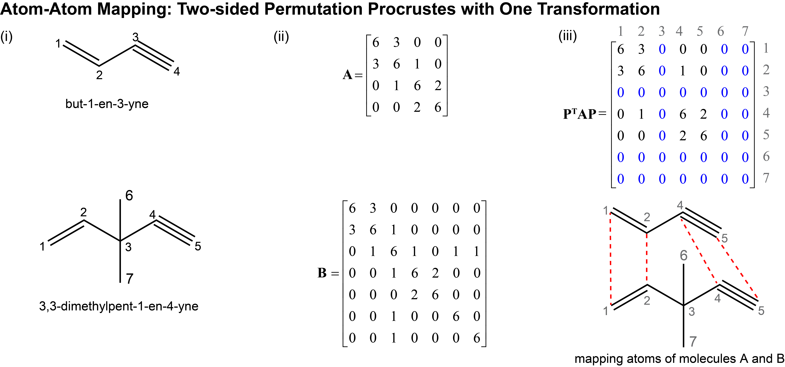

..
    : The Procrustes library provides a set of functions for transforming
    : a matrix to make it as similar as possible to a target matrix.
    :
    : Copyright (C) 2017-2021 The QC-Devs Community
    :
    : This file is part of Procrustes.
    :
    : Procrustes is free software; you can redistribute it and/or
    : modify it under the terms of the GNU General Public License
    : as published by the Free Software Foundation; either version 3
    : of the License, or (at your option) any later version.
    :
    : Procrustes is distributed in the hope that it will be useful,
    : but WITHOUT ANY WARRANTY; without even the implied warranty of
    : MERCHANTABILITY or FITNESS FOR A PARTICULAR PURPOSE.  See the
    : GNU General Public License for more details.
    :
    : You should have received a copy of the GNU General Public License
    : along with this program; if not, see <http://www.gnu.org/licenses/>
    :
    : --

Atom-Atom Mapping
=================

Given two molecular structures, it is important to be able to identify atoms that are chemically
similar. This a commonly used in 3D QSAR pharmacore analysis, substructure searching, metabolic
pathway identification, and chemical machine learning.

The code block below shows how easily the Procrustes library can be used to map atoms of
*but-1-en-3-yne* (A) and *3,3-dimethylpent-1-en-4-yne* (B) as depicted in **Fig. (i)**.
Based on our chemical intuition, we can tell that the triple and double bonds of both molecules
"match" one another; however, simple (geometric) molecular alignment based on three-dimensional
coordinates does not identify that. The pivotal step is defining a representation that contains
bonding information, and then using permutation Procrustes to match atoms between the two chemical
structures.

Inspired by graph theory, we represented each molecule with an "adjacency" matrix where the
diagonal elements are the atomic numbers and the off-diagonal elements are the bond orders
(matrix :math:`\mathbf{A} \in \mathbb{R}^{4 \times 4}` and
:math:`\mathbf{B} \in \mathbb{R}^{7 \times 7}`
in **Fig. (ii)** ). The two-sided permutation Procrustes (:class:`procrustes.permutation_2sided`)
with one-transformation can be used to find the optimal matching of the two matrices.

   Atom-atom Mapping with Two-sided Permutation Procrustes

It is important to note that the permutation Procrustes requires the two matrices to be of the
same size, so the smaller matrix :math:`\mathbf{A}` is padded with zero rows and columns to have
same shape as matrix :math:`\mathbf{B}`. After obtaining the optimal permutation matrix
:math:`\mathbf{P}`, the transformed matrix :math:`\mathbf{P^{\top}AP}` should be compared to
matrix :math:`\mathbf{B}` for identifying the matching atoms; the zero rows/columns correspond to
atoms in :math:`\mathbf{B}` for which there are no corresponding atoms in :math:`\mathbf{A}`. The
mapping between atoms can be also directly deduced from matrix :math:`\mathbf{P}`,

.. math::
    \min_{\mathbf{P}} {\left\lVert \mathbf{P}^{\top} \mathbf{A} \mathbf{P} - \mathbf{B}
        \right\rVert}_{F}^2

.. code-block:: python
    :linenos:

    import numpy as np

    from procrustes import permutation_2sided

    # Define molecule A representing "but-1-en-3-yne"
    A = np.array([[6, 3, 0, 0],
                  [3, 6, 1, 0],
                  [0, 1, 6, 2],
                  [0, 0, 2, 6]])

    # Define molecule B representing "3,3‐dimethylpent‐1‐en‐4‐yne"
    B = np.array([[6, 3, 0, 0, 0, 0, 0],
                  [3, 6, 1, 0, 0, 0, 0],
                  [0, 1, 6, 1, 0, 1, 1],
                  [0, 0, 1, 6, 2, 0, 0],
                  [0, 0, 0, 2, 6, 0, 0],
                  [0, 0, 1, 0, 0, 6, 0],
                  [0, 0, 1, 0, 0, 0, 6]])

    # two-sided permutation Procrustes
    result = permutation_2sided(A, B, single=True, pad=True)

    # Compute the transformed molecule A
    P = result.t
    new_A = np.dot(P.T, np.dot(result.new_a, P)).astype(int)
    print("Transformed A: \n", new_A)    # compare to B

The computed result is shown in the **Fig. (iii)**, generating ideal matching of the double and
triple carbon-carbon bonds. The new matrix representation of :math:`\mathbf{A}` suggests that atom
3 is empty since the third row and third column of :math:`\mathbf{A}` are zero (matrix elements
in blue). That is, a virtual atom 3 was added to molecule :math:`\mathbf{A}` to align with atom 3
in molecule :math:`\mathbf{B}`. Similarly, atoms 6 and 7 in molecule `\mathbf{B}` (matrix
elements in blue) do not have meaningful matches in :math:`\mathbf{A}`, and are mapped to two
virtual atoms, atom 6 and 7 in molecule :math:`\mathbf{A}`. This example is inspired by
:cite:`zadeh2013molecular`.
