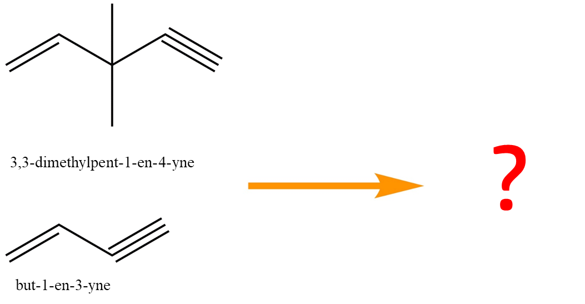
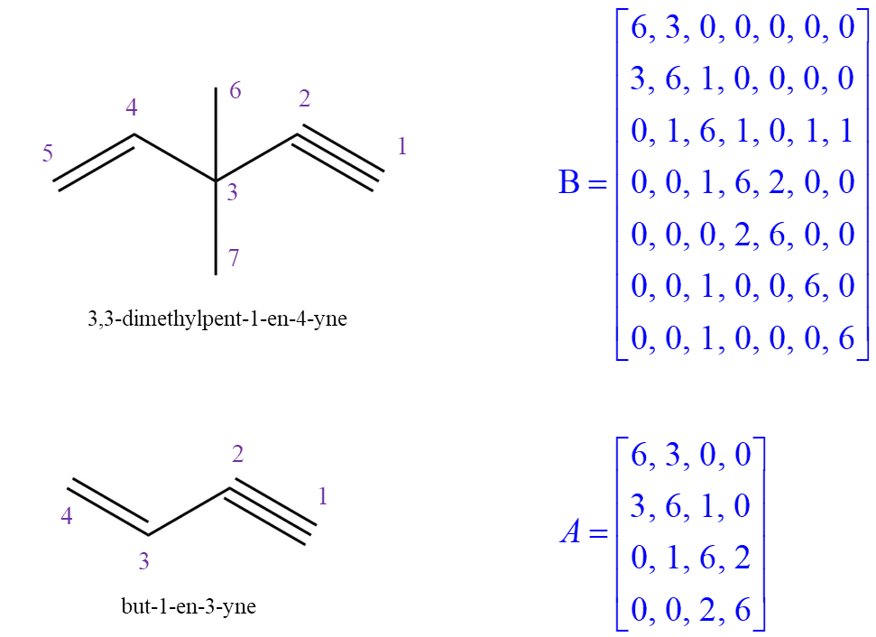

..
    : Procrustes is a collection of interpretive chemical tools for
    : analyzing outputs of the quantum chemistry calculations.
    :
    : Copyright (C) 2017-2018 The Procrustes Development Team
    :
    : This file is part of Procrustes.
    :
    : Procrustes is free software; you can redistribute it and/or
    : modify it under the terms of the GNU General Public License
    : as published by the Free Software Foundation; either version 3
    : of the License, or (at your option) any later version.
    :
    : Procrustes is distributed in the hope that it will be useful,
    : but WITHOUT ANY WARRANTY; without even the implied warranty of
    : MERCHANTABILITY or FITNESS FOR A PARTICULAR PURPOSE.  See the
    : GNU General Public License for more details.
    :
    : You should have received a copy of the GNU General Public License
    : along with this program; if not, see <http://www.gnu.org/licenses/>
    :
    : --

Atom-Atom Mapping
=================

Atom-atom mapping can help chemists and biologist to get a better understanding of the reaction
mechanisms and provide clues for lead compound optimization for medicinal chemists. In this example,
we are going to use two sided permutation Procrustes, which has been implemented
:class:`procrustes.permutation_2sided`.

The example we are going to use is shown below, which is the atom-atom mapping between
*3,3‐dimethylpent‐1‐en‐4‐yne* and *but‐1‐en‐3‐yne*. For clarity, we denote
*but‐1‐en‐3‐yne* molecule **A** and *3,3‐dimethylpent‐1‐en‐4‐yne* molecule **B**. What would be
most reasonable mapping? If it is not mapping the double bounds and triple bonds respectively, it is
not a good matching based on our chemical knowledge.

    Two organic compounds for atom-atom mapping.

In order to figure the mapping relationship, one needs to represent the molecules in a matrix
format. We will save the nuclear charge as the diagonal elements and the bond orders for
off-diagonal ones, which has been depicted below. In this way, the matrix
:math:`A \in \mathcal{R}^{7 \times 7}` and the matrix :math:`B \in \mathcal{R}^{4 \times 4}` are
built, both of which are symmetric. The atoms are also labeled for later discussion.

    Graphical representation for two molecules.

Now we can compute the atom-atom mapping based on the matrices.

.. code-block:: python
   :linenos:

   # import libraries
   import numpy as np
   from procrustes import permutation_2sided

   def mol_align(A, B):
    r"""Align two molecules using two sided permutation Procrustes with one
    transformation."""
    # Compute the permutation matrix
    temp_A, _, U, e_opt = permutation_2sided(
        A, B, transform_mode='single_undirected',
        remove_zero_col=False, remove_zero_row=False)

    # Compute the transformed molecule A
    new_A = np.dot(U.T, np.dot(temp_A, U))
    # B
    new_B = B

    return new_A, new_B, U, e_opt

The calculations for our example is very simple,

.. code-block:: python

    new_A_transformed, new_B, U, e_opt = mol_align(A, B)

.. figure:: examples/atom_mapping/atom_mapping1.png
    :align: center
    :width: 600 px
    :figclass: align-center

    Atom-atom mapping between two organic molecules

We can tell from the figure that the number of atoms in molecule **A** has been extended to 7 by
adding 3 virtual atoms, namely atom 3, 6 and 7. In this mapping, we can tell that the triple bonds
and double bounds are aligned pair-wise and atom 3 in **B** corresponds to the newly generated atom
3 in molecule **A**. The atoms, 6 and 7, in molecule **B** do not have a physical matching with any
meanings. All the codes have been wrapped into a single script file. This example as inspired by
:cite:`zadeh2013molecular`.
