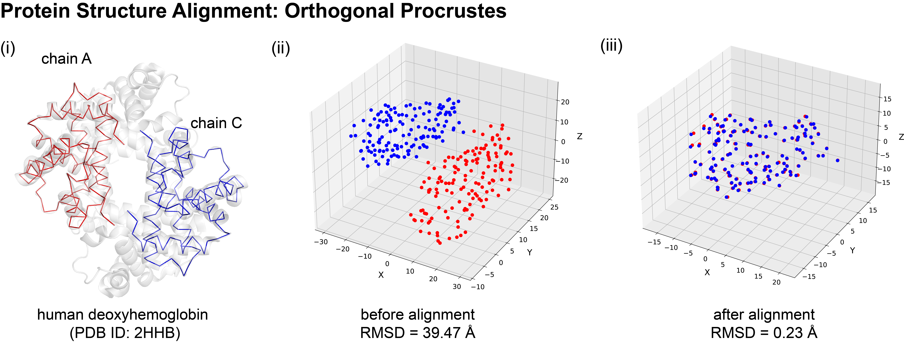

..
    : The Procrustes library provides a set of functions for transforming
    : a matrix to make it as similar as possible to a target matrix.
    :
    : Copyright (C) 2017-2021 The QC-Devs Community
    :
    : This file is part of Procrustes.
    :
    : Procrustes is free software; you can redistribute it and/or
    : modify it under the terms of the GNU General Public License
    : as published by the Free Software Foundation; either version 3
    : of the License, or (at your option) any later version.
    :
    : Procrustes is distributed in the hope that it will be useful,
    : but WITHOUT ANY WARRANTY; without even the implied warranty of
    : MERCHANTABILITY or FITNESS FOR A PARTICULAR PURPOSE.  See the
    : GNU General Public License for more details.
    :
    : You should have received a copy of the GNU General Public License
    : along with this program; if not, see <http://www.gnu.org/licenses/>
    :
    : --

Chemical Structure Alignment
============================

Molecular alignment is a fundamental problem in cheminformatics and can be used for structure
determination, similarity based searching, and ligand-based drug design et al. This problem can be
solved by orthogonal Procrustes when given two matrices representing three-dimensional
coordinates. The code block below shows the ease-of-use of the Procrustes library for protein
structure alignment, one of the most fundamental problems in structural biophysics.

Here, we are going to use procrustes.rotational for protein structure alignment as an example,
which is one of the fundamental problems in structural biology and structured-based drug design.
A well-known structure alignment method is the Kabsch
algorithm :cite:`kabsch1976solution,kabsch1978discussion`, which involves three steps:

1. translation of the structures to have a common centroid;
2. computation of the coordinate covariance matrix;
3. finding the optimal rotation matrix.

This is simply a rotational Procrustes problem.

Here, we used *IOData* library to load the Protein Data Bank (PDB)
file format containing the X-ray crystal structure of the human deoxyhemoglobin (PDB ID: 2HHB).
This selection of this protein was inspired by the `BiomolecularStructures library
<https://biomolecularstructures.readthedocs.io/en/latest/kabsch/>`_ which contains the well-known
Kabsch algorithm for structure alignment. This algorithm is the same as rotational Procrustes,
which allows one to compare the accuracy and efficiency of our implementation to those of
existing libraries.

The structure of 2HHB has
cyclic-:math:`C_2`  global symmetry, where chain A and chain C (chain B and chain D) are hemoglobin
deoxy-alpha (beta) chains as denoted in **Fig. (i)**. Thus the rotational Procrustes can
be used to align the :math:`C_{\alpha}` atoms in chain A and C of the protein to show that they
are homologous. The root-mean-square deviation (RMSD) is traditionally used to assess the
discrepancy between structures before and after the translation-rotation transformation with 39.5
Å (**Fig. (ii)**) and 0.23 Å (**Fig. (iii)**) respectively.

    Protein structure alignment with rotational Procrustes

.. code-block:: python
    :linenos:

    import numpy as np

    from iodata import load_one
    from iodata.utils import angstrom
    from procrustes import rotational

    # load PDB
    pdb = load_one("notebook_data/chemical_strcuture_alignment/2hhb.pdb")

    # get coordinates of C_alpha atoms in chains A & C (in angstrom)
    chainid = pdb.extra['chainids']
    attypes = pdb.atffparams['attypes']
    # alpha carbon atom coordinates in chain A
    ca_a = pdb.atcoords[(chainid == 'A') & (attypes == 'CA')] / angstrom
    # alpha carbon atom coordinates in chain A
    ca_c = pdb.atcoords[(chainid == 'C') & (attypes == 'CA')] / angstrom

Root-mean-square deviation (RMSD) is a used to assess the discrepancy between structures, and was
calculated before and after superposition translation and rotation operations were performed by
rotational orthogonal Procrustes. The RMSD values before alignment is calculated as 39.47 Å,
reaffirming that chain A and chain C are far away from each other.

.. code-block:: python
    :linenos:

    rmsd_before = np.sqrt(np.mean(np.sum((ca_a - ca_c)**2, axis=1)))
    print("RMSD of initial coordinates:", rmsd_before)

    # define a function to plot the coordinates

    import matplotlib.pyplot as plt
    from mpl_toolkits.mplot3d import Axes3D

    def plot_atom_coordinates(coords1, coords2,
                              figsize=(12, 10),
                              fontsize_label=14,
                              fontsize_title=16,
                              fontsize_legend=16,
                              label1=None,
                              label2=None,
                              title=None,
                              figfile=None):
        """Plot Cartesian coordinates of given atoms.

        Parameters
        ----------
        coords1: np.ndarray
            Cartesian coordinates of given atom set 1.
        coords2: np.ndarray
            Cartesian coordinates of given atom set 2.
        figsize : (float, float), optional
            Figure size with width and height in inchies.
        fontsize_label: int, optional
            The font size for labels. Default=14.
        fontsize_label: int, optional
            The font size for title. Default=16.
        label1 : str, optional
            Label for coords1. Default=None.
        label2 : str, optional
            Label for coords2. Default=None.
        title : str, optional
            Figure title. Default=None.
        figfile : str, optional
            Figure file name to save it. Default=None.

        """
        fig = plt.figure(figsize=figsize)
        ax = Axes3D(fig)

        ax.scatter(xs=coords1[:, 0], ys=coords1[:, 1], zs=coords1[:, 2],
                   marker="o", color="blue", s=40, label=label1)
        ax.scatter(xs=coords2[:, 0], ys=coords2[:, 1], zs=coords2[:, 2],
                   marker="o", color="red", s=40, label=label2)

        ax.set_xlabel("X", fontsize=fontsize_label)
        ax.set_ylabel("Y", fontsize=fontsize_label)
        ax.set_zlabel("Z", fontsize=fontsize_label)
        ax.legend(fontsize=fontsize_legend, loc="best")

        plt.title(title,
                  fontsize=fontsize_title)
        # save figure to a file
        if figfile:
            plt.savefig(figfile)

        plt.show()

    # plot the coordinates before alignment which reproduces Fig. (ii)
    title = "Chain A and chain C before alignment with rmsd={:0.2f} $\AA$.".format(rmsd_before)
    plot_atom_coordinates(coords1=ca_a,
                          coords2=ca_c,
                          label1="Chain_A",
                          label2="Chain_C",
                          title=title)

Now, we use rotational Procrustes to perform the structure alignment and plot the coordinates.

.. code-block:: python
    :linenos:

    result = rotational(ca_a, ca_c, translate=True)

    # compute transformed (translated & rotated) coordinates of chain A
    ca_at = np.dot(result.new_a, result.t)

    # now new_A is the array after rotation
    rmsd_after = np.sqrt(np.mean(np.sum((ca_at - result.new_b)**2, axis=1)))
    print("RMSD of transformed coordinates:", rmsd_after)

    # plot the coordinates before alignment which reproduces Fig. (iii)
    title = "Chain A and chain C before alignment with rmsd={:0.2f} $\AA$.".format(rmsd_after)
    plot_atom_coordinates(coords1=ca_at,
                          coords2=result["new_b"],
                          label1="Chain_A",
                          label2="Chain_C",
                          title=title)

All the Cα atoms become close to each other after to translation and rotation (the above figure)
with rmsd value 0.23 :math:`\unicode{x212B}`. This affirms that the utility of rotational
Procrustes in protein alignment.
