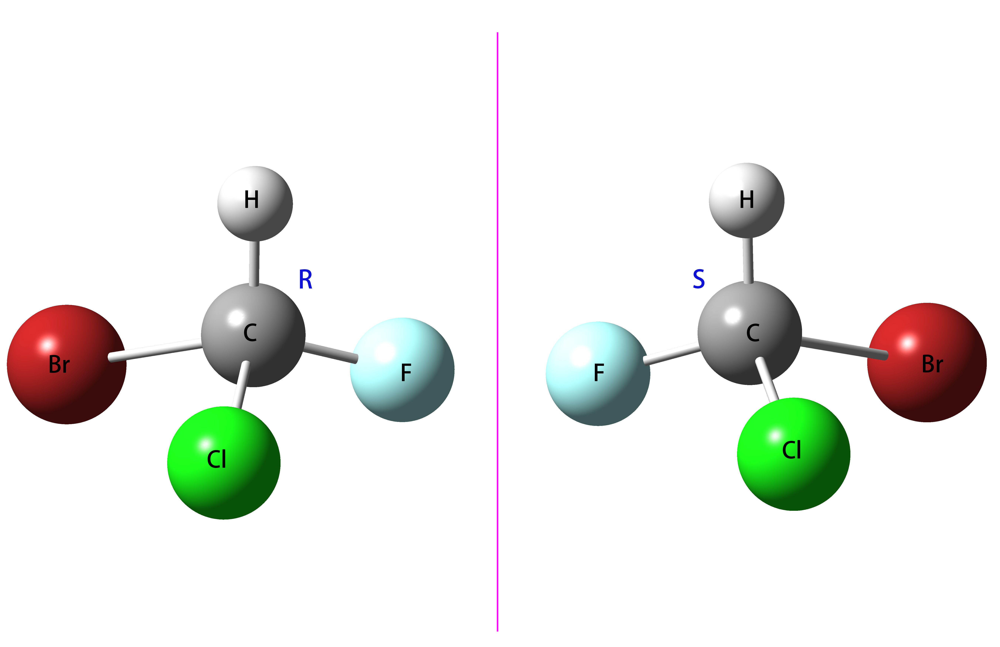

..
    : The Procrustes library provides a set of functions for transforming
    : a matrix to make it as similar as possible to a target matrix.
    :
    : Copyright (C) 2017-2021 The QC-Devs Community
    :
    : This file is part of Procrustes.
    :
    : Procrustes is free software; you can redistribute it and/or
    : modify it under the terms of the GNU General Public License
    : as published by the Free Software Foundation; either version 3
    : of the License, or (at your option) any later version.
    :
    : Procrustes is distributed in the hope that it will be useful,
    : but WITHOUT ANY WARRANTY; without even the implied warranty of
    : MERCHANTABILITY or FITNESS FOR A PARTICULAR PURPOSE.  See the
    : GNU General Public License for more details.
    :
    : You should have received a copy of the GNU General Public License
    : along with this program; if not, see <http://www.gnu.org/licenses/>
    :
    : --

Chirality Check
===============

Chirality is a symmetry property with great significance in chemistry, biology and pharmaceutical
science. Here we show how to determine if two compounds are enantiomers by using rotational
procrustes method. Suppose we have two compounds with the same formula: CHFClBr and there is one
chiral carbon atom in each of them. The absolute configuration of the compounds have been labeled in
the figure.

.. _label2:

    Ball-stick model of enantiomers

The idea behind our example is that we compare the error difference for alignment with only rotation
and alignment of rotation after reflection. If the difference is big, we can conclude that there is
a chiral carbon in each molecule.

We have extracted the 3D coordinates of the molecule into two different files, namely "R.dat" and
"S.dat". We compute the reflection of the first molecule after importing the coordinates, followed
by a rotation. Moreover, we perform another rotational alignment without reflection. Now, we are at
position to conclusion based the error difference.

.. code-block:: python
  :linenos:

  # import libraries
  import numpy as np
  from procrustes import *

  def chiral_check(A_coords, B_coords):
      r"""Check if a organic compound is chiral.

      Parameters
      ----------
      A_coords : string
          Atomic coordinates of the first organic compound A.
      B_coords : string
          Atomic coordinates of the first organic compound B.
      Returns
      -------
      A : ndarray
          3D coordinates of the first organic compound A.
      B : ndarray
          3D coordinates of the first organic compound B.
      """

      reflection = np.array([[-1, 0, 0], [0, 1, 0], [0, 0, 1]])
      # create the reflection of compound A over the yz plane
      A_ref = np.dot(A_coords, reflection)
      # Compute the rotational procrustes
      res = rotational(A_coords, B_coords,
                       translate=True,
                       scale=False,
                       remove_zero_col=False,
                       remove_zero_row=False)
      # Compute the error: reflection + rotation
      res_ref = rotational(A_ref, B_coords,
                           translate=True,
                           scale=False,
                           remove_zero_col=False,
                           remove_zero_row=False)

      if res["e_opt"] / res_ref["e_opt"] > 10:
          print("These two compounds are enantiomers "
                "and there is at least one chiral center in each of them.")
      else:
          print("These two compounds are not enantiomers "
                "and there is no chiral center in any of them.")

  if __name__ == "__main__":
      chiral_check(A_data, B_data)

The error for only ration operation is 7.30 while it becomes 1.24e-08 after a reflection operation.
Therefore, this example showed how we can use rotational procrustes to check chirality in organic
compounds.
