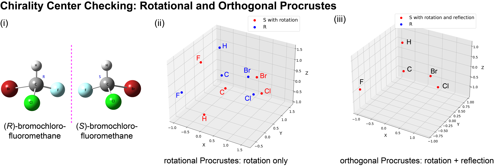

..
    : The Procrustes library provides a set of functions for transforming
    : a matrix to make it as similar as possible to a target matrix.
    :
    : Copyright (C) 2017-2021 The QC-Devs Community
    :
    : This file is part of Procrustes.
    :
    : Procrustes is free software; you can redistribute it and/or
    : modify it under the terms of the GNU General Public License
    : as published by the Free Software Foundation; either version 3
    : of the License, or (at your option) any later version.
    :
    : Procrustes is distributed in the hope that it will be useful,
    : but WITHOUT ANY WARRANTY; without even the implied warranty of
    : MERCHANTABILITY or FITNESS FOR A PARTICULAR PURPOSE.  See the
    : GNU General Public License for more details.
    :
    : You should have received a copy of the GNU General Public License
    : along with this program; if not, see <http://www.gnu.org/licenses/>
    :
    : --

Chirality Check
===============

In chemistry, a molecule is chiral if it cannot be superimposed onto its mirror image by any
combination of translation and rotation. These non-supposable mirror images are called
enantiomers which share identical chemical and physical properties, but have distinct chemical
reactivity and optical rotation properties.

   Enantiomers prediction of CHFClBr with rotational-orthogonal Procrustes by comparing atomic coordinates.

This example shows how easily the `Procrustes` library can be used to check whether two geometries
of the CHFClBr molecule are enantiomers using
`IOData <https://github.com/theochem/iodata>`_ library to obtain their
three-dimensional coordinates from XYZ files (**Fig. (i)**). This is done by testing whether their
coordinates can be matched through translation and rotation (i.e., rotational Procrustes);
the obtained Procrustes error of 26.09 Å reveals that these two structures are not identical.
However, it is confirmed that the two coordinates are enantiomers because they can be matched
through translation, rotation, and reflection (i.e., orthogonal Procrustes) gives a Procrustes
error of :math:`4.43 \times 10^{-8} Å`; thus, reflection is essential to match the structures.

.. code-block:: python
    :linenos:

    # load the libraries
    import numpy as np

    from iodata import load_one
    from procrustes import orthogonal, rotational

    # load CHClFBr enantiomers' coordinates from XYZ files
    a = load_one("notebook_data/chirality_checking/enantiomer1.xyz").atcoords
    b = load_one("notebook_data/chirality_checking/enantiomer2.xyz").atcoords

    # rotational Procrustes on a & b coordinates
    result_rot = rotational(a, b, translate=True, scale=False)
    print("Error =", result_rot.error)

    # rotational Procrustes on a & b coordinates
    result_rot = rotational(a, b, translate=True, scale=False)
    print("Error =", result_rot.error)

Now we define a function to plot the coordinates and then plot the coordinates only with rotation,

.. code-block:: python
    :linenos:

    import matplotlib.pyplot as plt
    from mpl_toolkits.mplot3d import Axes3D

    The error for only ration operation is 7.30 while it becomes 1.24e-08 after a reflection operation.
    def plot_atom_coordinates(coords1, coords2,Therefore, this example showed how we can use rotational procrustes to check chirality in organic
                              figsize=(12, 10),compounds.
                              fontsize_label=14,

    # rotated coordinates
    a_rot = np.dot(a, result_rot.t)

    # plot coordinates with only rotation
    plot_atom_coordinates(a_rot, b,
                          figsize=(10, 8),
                          fontsize_label=14,
                          fontsize_title=16,
                          fontsize_legend=16,
                          label1="enantiomer1 with rotation",
                          label2="enantiomer2",
                          title="Error={:0.2f}".format(result_rot.error),
                          figfile=None)

Then we check the case with both rotation and reflection,

.. code-block:: python
    :linenos:

    # orthogonal Procrustes on a & b coordinates
    result_ortho = orthogonal(a, b, translate=True, scale=False)
    print("Error =", result_ortho.error)

    # rotated and refelction coordinates
    a_ortho = np.dot(a, result_ortho.t)

    # plot coordinates with only rotation
    plot_atom_coordinates(a_ortho, b,
                          figsize=(10, 8),
                          fontsize_label=14,
                          fontsize_title=16,
                          fontsize_legend=16,
                          label1="enantiomer1 with orthoation and reflection",
                          label2="enantiomer2",
                          title="Error={:0.2f}".format(result_ortho.error),
                          figfile=None)

.. image:: https://img.shields.io/badge/binder-chirality%20check-579ACA.svg?logo=data:image/png;base64,iVBORw0KGgoAAAANSUhEUgAAAFkAAABZCAMAAABi1XidAAAB8lBMVEX///9XmsrmZYH1olJXmsr1olJXmsrmZYH1olJXmsr1olJXmsrmZYH1olL1olJXmsr1olJXmsrmZYH1olL1olJXmsrmZYH1olJXmsr1olL1olJXmsrmZYH1olL1olJXmsrmZYH1olL1olL0nFf1olJXmsrmZYH1olJXmsq8dZb1olJXmsrmZYH1olJXmspXmspXmsr1olL1olJXmsrmZYH1olJXmsr1olL1olJXmsrmZYH1olL1olLeaIVXmsrmZYH1olL1olL1olJXmsrmZYH1olLna31Xmsr1olJXmsr1olJXmsrmZYH1olLqoVr1olJXmsr1olJXmsrmZYH1olL1olKkfaPobXvviGabgadXmsqThKuofKHmZ4Dobnr1olJXmsr1olJXmspXmsr1olJXmsrfZ4TuhWn1olL1olJXmsqBi7X1olJXmspZmslbmMhbmsdemsVfl8ZgmsNim8Jpk8F0m7R4m7F5nLB6jbh7jbiDirOEibOGnKaMhq+PnaCVg6qWg6qegKaff6WhnpKofKGtnomxeZy3noG6dZi+n3vCcpPDcpPGn3bLb4/Mb47UbIrVa4rYoGjdaIbeaIXhoWHmZYHobXvpcHjqdHXreHLroVrsfG/uhGnuh2bwj2Hxk17yl1vzmljzm1j0nlX1olL3AJXWAAAAbXRSTlMAEBAQHx8gICAuLjAwMDw9PUBAQEpQUFBXV1hgYGBkcHBwcXl8gICAgoiIkJCQlJicnJ2goKCmqK+wsLC4usDAwMjP0NDQ1NbW3Nzg4ODi5+3v8PDw8/T09PX29vb39/f5+fr7+/z8/Pz9/v7+zczCxgAABC5JREFUeAHN1ul3k0UUBvCb1CTVpmpaitAGSLSpSuKCLWpbTKNJFGlcSMAFF63iUmRccNG6gLbuxkXU66JAUef/9LSpmXnyLr3T5AO/rzl5zj137p136BISy44fKJXuGN/d19PUfYeO67Znqtf2KH33Id1psXoFdW30sPZ1sMvs2D060AHqws4FHeJojLZqnw53cmfvg+XR8mC0OEjuxrXEkX5ydeVJLVIlV0e10PXk5k7dYeHu7Cj1j+49uKg7uLU61tGLw1lq27ugQYlclHC4bgv7VQ+TAyj5Zc/UjsPvs1sd5cWryWObtvWT2EPa4rtnWW3JkpjggEpbOsPr7F7EyNewtpBIslA7p43HCsnwooXTEc3UmPmCNn5lrqTJxy6nRmcavGZVt/3Da2pD5NHvsOHJCrdc1G2r3DITpU7yic7w/7Rxnjc0kt5GC4djiv2Sz3Fb2iEZg41/ddsFDoyuYrIkmFehz0HR2thPgQqMyQYb2OtB0WxsZ3BeG3+wpRb1vzl2UYBog8FfGhttFKjtAclnZYrRo9ryG9uG/FZQU4AEg8ZE9LjGMzTmqKXPLnlWVnIlQQTvxJf8ip7VgjZjyVPrjw1te5otM7RmP7xm+sK2Gv9I8Gi++BRbEkR9EBw8zRUcKxwp73xkaLiqQb+kGduJTNHG72zcW9LoJgqQxpP3/Tj//c3yB0tqzaml05/+orHLksVO+95kX7/7qgJvnjlrfr2Ggsyx0eoy9uPzN5SPd86aXggOsEKW2Prz7du3VID3/tzs/sSRs2w7ovVHKtjrX2pd7ZMlTxAYfBAL9jiDwfLkq55Tm7ifhMlTGPyCAs7RFRhn47JnlcB9RM5T97ASuZXIcVNuUDIndpDbdsfrqsOppeXl5Y+XVKdjFCTh+zGaVuj0d9zy05PPK3QzBamxdwtTCrzyg/2Rvf2EstUjordGwa/kx9mSJLr8mLLtCW8HHGJc2R5hS219IiF6PnTusOqcMl57gm0Z8kanKMAQg0qSyuZfn7zItsbGyO9QlnxY0eCuD1XL2ys/MsrQhltE7Ug0uFOzufJFE2PxBo/YAx8XPPdDwWN0MrDRYIZF0mSMKCNHgaIVFoBbNoLJ7tEQDKxGF0kcLQimojCZopv0OkNOyWCCg9XMVAi7ARJzQdM2QUh0gmBozjc3Skg6dSBRqDGYSUOu66Zg+I2fNZs/M3/f/Grl/XnyF1Gw3VKCez0PN5IUfFLqvgUN4C0qNqYs5YhPL+aVZYDE4IpUk57oSFnJm4FyCqqOE0jhY2SMyLFoo56zyo6becOS5UVDdj7Vih0zp+tcMhwRpBeLyqtIjlJKAIZSbI8SGSF3k0pA3mR5tHuwPFoa7N7reoq2bqCsAk1HqCu5uvI1n6JuRXI+S1Mco54YmYTwcn6Aeic+kssXi8XpXC4V3t7/ADuTNKaQJdScAAAAAElFTkSuQmCC
    :align: center
    :target: https://mybinder.org/v2/gh/theochem/procrustes/master?filepath=docs%2Fnotebooks%2F/Chirality_Check.ipynb
