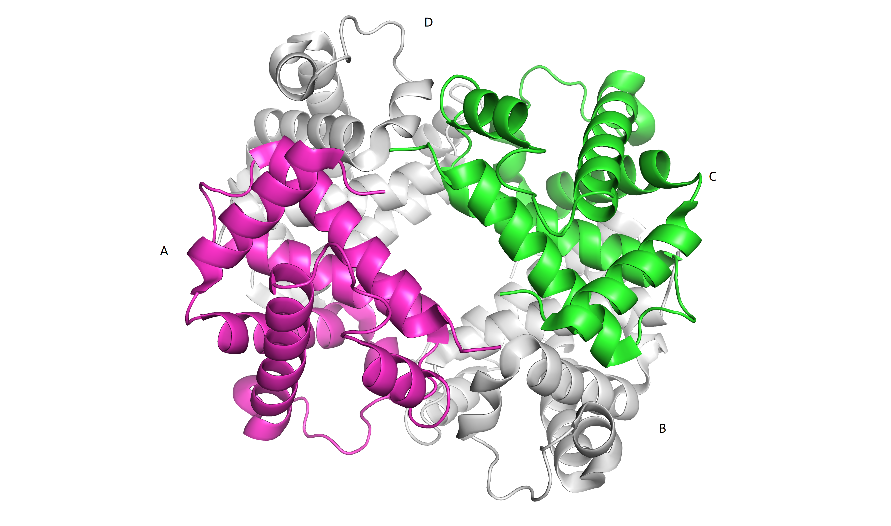
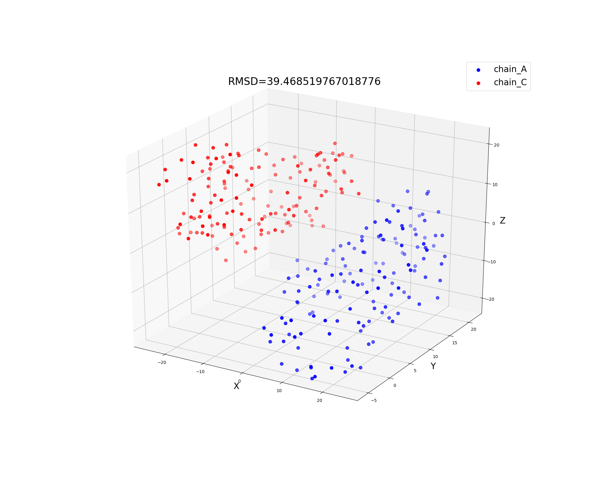
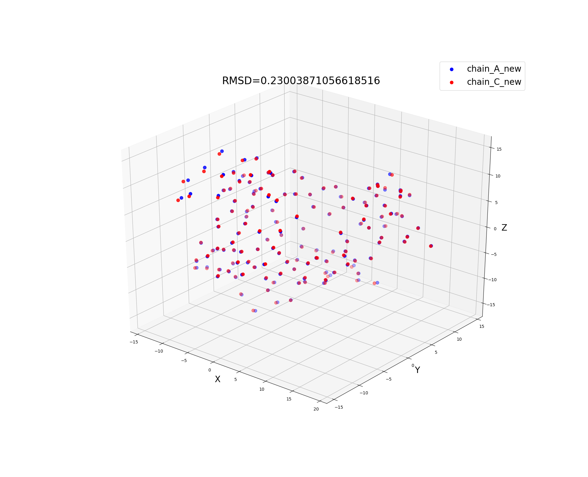

..
    : Procrustes is a collection of interpretive chemical tools for
    : analyzing outputs of the quantum chemistry calculations.
    :
    : Copyright (C) 2017-2018 The Procrustes Development Team
    :
    : This file is part of Procrustes.
    :
    : Procrustes is free software; you can redistribute it and/or
    : modify it under the terms of the GNU General Public License
    : as published by the Free Software Foundation; either version 3
    : of the License, or (at your option) any later version.
    :
    : Procrustes is distributed in the hope that it will be useful,
    : but WITHOUT ANY WARRANTY; without even the implied warranty of
    : MERCHANTABILITY or FITNESS FOR A PARTICULAR PURPOSE.  See the
    : GNU General Public License for more details.
    :
    : You should have received a copy of the GNU General Public License
    : along with this program; if not, see <http://www.gnu.org/licenses/>
    :
    : --

Protein Structure Alignment
===========================

Protein structure alignment is one of the fundamental problems in structural biology and structured
based drug design. A well-known structure alignment method is Kabsch algorithm
:cite:`kabsch1976solution,kabsch1978discussion`, which involves three steps, centroid of
the coordinates,  computation of the covariance matrix and finding the optimal rotation matrix. When
translation is a mandatory operation, the problems evolves into a rotational Procrustes problem.

We will use the human deocyhemoglobin X-ray crystal structure as an example (PDB ID: 2HHB) which was
inspired by the example in https://biomolecularstructures.readthedocs.io/en/latest/kabsch/.
The structure is of cyclic - C2 global symmetry, where chain A (magenta) and chain C (green) are
hemoglobin (deoxy) alpha chains, and chain B and D are hemoglobin (deoxy) beta chains.

.. _lable:

    X-ray crystal structure of human deocyhemoglobin (PDB ID: 2HHB)

Before we align the coordinates let's take a look at the 3-dimensional coordinates of the
:math:`C_{\alpha}` in the backbones. This function will extract the coordinates by using the
Biopython (http://biopython.org/). The installation guide of Biopython can be found
http://biopython.org/DIST/docs/install/Installation.html.

.. code-block:: python
  :linenos:

  def get_coordinates(file_name, pdb_id, chain_id):
    r"""
    Build alpha carbon coordinates matrix from PDB file.

    Parameters
    ----------
    file_name : string
        PDB file name.
    pdb_id : string
        PDB ID.
    chain_id : string
        Chain ID. Possible inputs can be any of 'A', 'B', 'C', et al., if it exists in the protein.

    Returns
    -------
    matrix : float
        3D coordinates of the assigned PDB structure.
    """

    # permissive parser
    p = PDBParser(PERMISSIVE=1)
    structure = p.get_structure(pdb_id, file_name)
    # get X-ray crystal structure
    matrix = []
    chain = structure[0][chain_id]

    for residue in chain:
        for atom in residue:
            # Using residue['CA'] results in error
            if atom.get_id() == 'CA':
                matrix += list(atom.get_vector())
    matrix = np.asarray(matrix).reshape(-1, 3)

    return matrix

The PDBConstructionWarning warnings will not have side effects on extracting the coordinates. This
function serve as a script to extract the coordinate information by given file name, PDB ID and
chain ID. Notice that all the inputs are strings. Moreover, a `compute_rmsd` function is defined to
calculate the root mean squared derivation (RMSD) values.

.. code-block:: python
   :linenos:

   def _compute_rmsd(A, B):
    r"""
    Calculate root mean square deviation (RMSD).

    Parameters
    ----------
    A : ndarray
    B : ndarray

    Returns
    -------
    rmsd : float
        RMSD value of A and B.
    """

    # Check if A and B are with the same dimension
    if A.shape != B.shape:
        raise ValueError("INput matrices must be with the same shape\
                         for rmsd calculations.")
    D = len(A[0, :])
    N = len(A[:, 0])

    # Compute rmsd
    rmsd = 0.0
    for a, b in zip(A, B):
        rmsd += sum([(a[i] - b[i])**2.0 for i in range(D)])
    return np.sqrt(rmsd/N)

Now we can plot the coordinates before alignment which is with rmsd value.

.. code-block:: python
   :linenos:

   # import required libraries
   from Bio.PDB.PDBParser import PDBParser
   from mpl_toolkits.mplot3d import Axes3D
   import matplotlib.pyplot as plt
   from procrustes import rotational

   # before align
   A = _get_coordinates('2hhb.pdb', '2hhb', 'A')
   C = _get_coordinates('2hhb.pdb', '2hhb', 'C')

   fig = plt.figure()
   ax = fig.add_subplot(111, projection='3d')

   ax.scatter(A[:,0], A[:,1], A[:,2], zdir='z', s=55, c='blue', label='chain_A')
   ax.scatter(C[:,0], C[:,1], C[:,2], zdir='z', s=55, c='red', label='chain_C')

   ax.set_xlabel('X', fontsize=20)
   ax.set_ylabel('Y', fontsize=20)
   ax.set_zlabel('Z', fontsize=20)

   rmsd=_compute_rmsd(A, C)

   #ax.set_title(rmsd, fontsize=24)
   ax.set_title('RMSD=39.468519767018776', fontsize=24)
   ax.legend(fontsize=20)

   plt.show()
   # if you want to save the figure
   # run plt.savefig('before_align')

We can tell from the figure that the coordinates of chain A and chain C are quite far away from each
other with an RMSD value of 39.5.

    Coordinates and RMSD value before alignment (PDB ID: 2HHB)

In order to perform the alignment of :math:`C_{\alpha}` of the protein scaffold, we define the
`align` function using the rotational Procrustes.

.. code-block:: python
   :linenos:

   def align(file_name_A, pdb_id_A, chain_id_A,
          file_name_B, pdb_id_B, chain_id_B):
    r"""Align protein or protein chains by Kabsch algorithm."""
    # Get inputs coordinate matrices
    A = _get_coordinates(file_name_A, pdb_id_A, chain_id_A)
    B = _get_coordinates(file_name_B, pdb_id_B, chain_id_B)
    # Kabsch algorithm/ Procrustes rotation to
    # align protein structure
    # new_A is just the translated coordinate
    new_A, new_B, array_rot, _, = rotational(A, B,
                                             remove_zero_col=False,
                                             remove_zero_row=False,
                                             translate=True)
    # now new_A is the array after rotation
    new_A = np.dot(new_A, array_rot)
    # Compute the rmsd values
    rmsd = _compute_rmsd(new_A, new_B)

    return new_A, new_B, array_rot, rmsd

We can perform the alignment by the defined function `align` and plot the coordinates as well.

.. code-block:: python
   :linenos:

   # perform the alignment
   new_A, new_C, rot_array, rmsd = align(
    file_name_A='2hhb.pdb', pdb_id_A='2hhb', chain_id_A='A',
    file_name_B='2hhb.pdb', pdb_id_B='2hhb', chain_id_B='C')

   fig = plt.figure()
   ax = fig.add_subplot(111, projection='3d')

   ax.scatter(new_A[:,0], new_A[:,1], new_A[:,2], zdir='z', s=55,
       c='blue', label='chain_A_new')
   ax.scatter(new_C[:,0], new_C[:,1], new_C[:,2], zdir='z', s=55,
       c='red', label='chain_C_new')

   ax.set_xlabel('X', fontsize=16)
   ax.set_ylabel('Y', fontsize=16)
   ax.set_zlabel('Z', fontsize=16)

   #ax.set_title(rmsd, fontsize=24)
   ax.set_title('RMSD=0.23003871056618516', fontsize=16)
   ax.legend(fontsize=15)

   plt.show()
   # if you want to save the figure
   # run plt.savefig('after_align')

We can tell the function `align` efficiently aligned chain A and
chain C, leading to a small RMSD value (0.23). We have wrapped the code into `protein_align.py` and
people are free to use.

    Coordinates and RMSD value after alignment (PDB ID: 2HHB)
