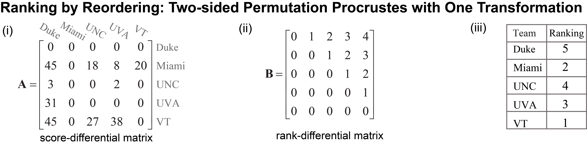

..
    : The Procrustes library provides a set of functions for transforming
    : a matrix to make it as similar as possible to a target matrix.
    :
    : Copyright (C) 2017-2021 The QC-Devs Community
    :
    : This file is part of Procrustes.
    :
    : Procrustes is free software; you can redistribute it and/or
    : modify it under the terms of the GNU General Public License
    : as published by the Free Software Foundation; either version 3
    : of the License, or (at your option) any later version.
    :
    : Procrustes is distributed in the hope that it will be useful,
    : but WITHOUT ANY WARRANTY; without even the implied warranty of
    : MERCHANTABILITY or FITNESS FOR A PARTICULAR PURPOSE.  See the
    : GNU General Public License for more details.
    :
    : You should have received a copy of the GNU General Public License
    : along with this program; if not, see <http://www.gnu.org/licenses/>
    :
    : --

Ranking by Reordering
=====================

The problem of ranking a set of objects is ubiquitous not only in everyday life, but also for
many scientific problems such as information retrieval, recommender systems, natural language
processing, and drug discovery. In this tutorial, we will rank footable teams based on the game
scores.

.. table:: Team by Team Game Score Data
   :align: center

   ======= ======= ======= ======= ======= =======
   Team     Duke    Miami    UNC     UVA     VT
   ======= ======= ======= ======= ======= =======
   Duke       0       0       0       0        0
   Miami     45       0      18       8       20
   UNC        3       0       0       2        0
   UVA       31       0       0       0        0
   VT        45       0       27     38        0
   ======= ======= ======= ======= ======= =======

The code block below shows how easily the *Procrustes* library can be used to rank five
American collegiate football teams, where each team plays one game against every other team,
using their score-differentials as summarized in Table 1 (The data taken from A. N. Langville, C.
D. Meyer, *Ranking by Reordering Methods*, Princeton University Press, 2012, Ch. 8, pp. 97–112.
:cite:`langville2012s`).

Here, each team is given a zero score for a game they lost (e.g., Duke lost to every other team)
and the score difference is calculated for games won (e.g., Miami beat Duke by 45 points and UNC
by 18 points). These results are also summarized in the square score-differential matrix
:math:`\mathbf{A}` in **Fig. (i)**. Two-sided permutation Procrustes can be used to rank these
teams, but one needs to define a proper target matrix. Traditionally, the rank-differential matrix
has been used for this purpose and is defined for :math:`n` teams as,

.. math::
   \begin{equation}
       \mathbf{R}_{n \times n} =
       \begin{bmatrix}
           0 & 1 & 2 & \cdots & n-1 \\
             & 0 & 1 & \cdots & n-2 \\
             &   &\ddots &\ddots & \vdots \\
             &   &   & \ddots & 1 \\
             &   &   &        & 0
       \end{bmatrix}
   \end{equation}

The rank-differential matrix :math:`\mathbf{R} \in \mathbb{R}^{n \times n}` is an upper-triangular
matrix and its :math:`ij`-th element specifies the difference in ranking between team :math:`i` and
team :math:`j`. This a sensible target for the score-differential matrix. Now,
the two-sided permutation Procrustes method can be used to find the permutation matrix that
maximizes the similarity between the score-differential matrix, :math:`\mathbf{A}`, and the
rank-differential matrix based on the definition of rank-differential matrix,
:math:`\mathbf{B}` (**Fig. (ii)**)

.. math::
   \begin{equation}
      \min_{\mathbf{P}} {\left\lVert \mathbf{P}^{\top} \mathbf{A} \mathbf{P} - \mathbf{B}
         \right\rVert}_{F}^2
   \end{equation}

This results to :math:`[5,2,4,3,1]` as the final rankings of the teams (**Fig. (iii)**).

   Ranking by reordering with two-sided permutation with one-transformation

In order to compute the *ranking vector*, we need the *fundamental rank-differential matrix*
:math:`\hat{R}_{n \times n}`. So we build a function

.. code-block:: python
   :linenos:

   import numpy as np

   from procrustes import permutation_2sided

   # input score-differential matrix
   A = np.array([[ 0, 0, 0 ,  0,  0 ],    # Duke
                 [45, 0, 18,  8,  20],    # Miami
                 [ 3, 0, 0 ,  2,  0 ],    # UNC
                 [31, 0, 0 ,  0,  0 ],    # UVA
                 [45, 0, 27, 38,  0 ]])   # VT

   # make rank-differential matrix
   n = A.shape[0]
   B = np.zeros((n, n))
   for index in range(n):
       B[index, index:] = range(0, n - index)

   # rank teams using two-sided Procrustes
   result = permutation_2sided(A, B, single=True,
                               mode='normal1', tol=10.e-6)

   # compute teams' ranks
   _, ranks = np.where(result.t == 1)
   ranks += 1
   print("Ranks = ", ranks)     # displays [5, 2, 4, 3, 1]

Why we need to add all the rank values by 1? Because Python's list index starts with 0, but we
often index starting from 1 for physical objects.
